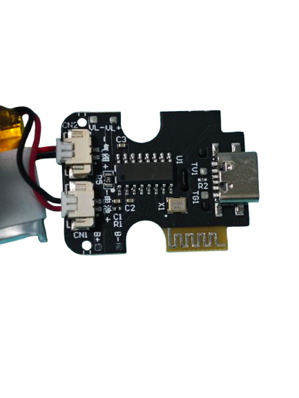

# cage-reverse
This is my attempt at reversing a BLE device, specifically a (redacted) key box. The attempt is inspired by the [Buttplug](https://github.com/buttplugio) project.

## The Device and Goals
The JEUSN key box accomodates up to 2 keys and the mechanism via sending signals over Bluetooth, using the manufactuer's own WeChat "mini program". The locking and unlocking is all done via the program itself.

Our goal here is to create our own program that can lock and unlock the device, bypassing the need for using the specialized program completely.

If we look at the board here, we can identify the following. The board has two JST-style connectors labeled CN1 and CN2, an unidentified IC chip in the middle, a USB type-C connector on the right, with several resistors (R1, R2) and capacitors (C1, C2,C3), and what appears to be a Bluetooth antenna (assumption since its a BLE device), and a 24,000 MHz crystal oscillator. B+ and B- simply means battery positive and negative terminals.

The chinese characters read 气阀 (air valve) and 电池 (battery), which suggest the locking part is controlled by some air valve mechanism.

## Bluetooth snooping
We make use of Android's own bluetooth snooping feature which can be enabled in developer settings, and then export the log to be read in Wireshark.

<b>To be continued.</b>

## The Mini Program
Wechat mini programs can be unpacked relatively easily. We make use of the tool [`wxapkg`](https://github.com/wux1an/wxapkg) to unpack the mini program.

<b>To be continued.</b>